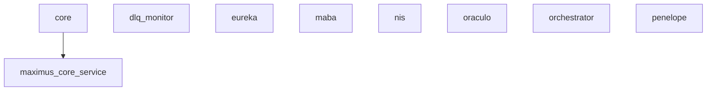

# MAXIMUS - Service Integration Map

**Gerado:** 2025-11-07 20:45:00
**Método:** Análise de imports e clients

---

## Service Dependencies Graph


## Integration Details

### core

#### `gemini_client`

```python
class GeminiConfig:
```

**Methods:**

#### `test_mip_integration`

**Methods:**

#### `test_ethical_ai_integration`

**Methods:**

#### `test_maximus_ethical_integration`

**Methods:**

#### `test_tui_integration`

```python
class TUIValidationResult:
```

**Methods:**
- `test_tui_imports()`
- `test_workspace_manager_instantiation()`

#### `test_neuromodulation_maximus_integration`

**Methods:**

#### `test_skill_learning_integration`

**Methods:**

#### `test_maximus_e2e_integration`

**Methods:**

#### `mcea_client`

```python
class MCEAClient:
```

**Methods:**
- `get_last_arousal()`
- `is_healthy()`

#### `mmei_client`

```python
class MMEIClient:
```

**Methods:**
- `get_last_needs()`
- `is_healthy()`

#### `arousal_integration`

```python
class ArousalModulationConfig:
```

**Methods:**
- `get_current_threshold()`
- `get_arousal_threshold_mapping()`
- `get_metrics()`

#### `test_hcl_integration`

**Methods:**

#### `test_maximus_integration`

**Methods:**

#### `test_attention_integration`

**Methods:**
- `get_data()`
- `on_critical()`

#### `test_predictive_coding_integration`

**Methods:**

#### `test_immune_consciousness_integration`

```python
class MockESGTEvent:
```

**Methods:**
- `set_needs()`
- `get_needs_dict()`
- `set_arousal()`
- `get_arousal_dict()`

#### `test_pfc_tom_integration`

```python
class TestPFCBasicIntegration:
```

**Methods:**
- `cleanup()`

#### `test_consciousness_integration`

**Methods:**
- `dummy_collector()`
- `dummy_collector()`

#### `test_safety_integration`

**Methods:**

#### `test_system_integration`

```python
class TestTIGESGTIntegration:
```

**Methods:**

#### `test_performance_integration`

**Methods:**
- `predict_fn()`

#### `test_immune_consciousness_integration`

```python
class MockESGTEvent:
```

**Methods:**
- `set_needs()`
- `get_needs_dict()`
- `set_arousal()`
- `get_arousal_dict()`

#### `test_adw_real_integration`

**Methods:**

#### `test_predictive_coding_maximus_integration`

**Methods:**

#### `test_integration`

**Methods:**

#### `fl_client`

```python
class ClientConfig:
```

**Methods:**
- `fetch_global_model()`
- `train_local_model()`
- `compute_update()`
- `send_update()`
- `participate_in_round()`
- `get_client_info()`
- `update_client_info()`

#### `vector_db_client`

```python
class VectorDBClient:
```

**Methods:**

#### `test_neuromodulation_integration`

**Methods:**

#### `client`

```python
class MIPClientError(Exception):
```

**Methods:**

---

### dlq_monitor

_No integration clients found_

---

### eureka

#### `coagulation_client`

```python
class AttackVectorType(str, Enum):
```

**Methods:**
- `to_dict()`
- `detect_attack_vector_from_cwe()`

#### `test_coagulation_client`

**Methods:**

#### `base_client`

```python
class LLMProvider(str, Enum):
```

**Methods:**
- `provider()`
- `count_tokens()`
- `estimate_cost()`

#### `claude_client`

```python
class ClaudeClient(BaseLLMClient):
```

**Methods:**
- `provider()`
- `count_tokens()`
- `estimate_cost()`

---

### maba

#### `vault_client`

```python
class VaultConfig:
```

**Methods:**
- `get_secret()`
- `set_secret()`
- `delete_secret()`
- `list_secrets()`

#### `maximus_integration`

```python
class ToolCategory(str, Enum):
```

**Methods:**
- `create_tool_definition()`

#### `thalamus_client`

```python
class ThalamusClient:
```

**Methods:**

#### `test_vault_client`

```python
class TestVaultConfig:
```

**Methods:**
- `test_default_config()`
- `test_env_var_override()`
- `test_init_without_hvac()`
- `test_init_with_token()`
- `test_init_with_approle()`
- `test_init_without_credentials()`
- `test_init_approle_failure_fail_open()`
- `test_init_failure_no_fail_open()`
- `test_cache_store_and_retrieve()`
- `test_cache_expiry()`
- `test_cache_miss()`
- `test_get_secret_success()`
- `test_get_secret_full_dict()`
- `test_get_secret_from_cache()`
- `test_get_secret_bypass_cache()`

#### `vertice_registry_client`

```python
class RegistryClient:
```

**Methods:**

#### `kafka_client`

```python
class UnifiedKafkaClient:
```

**Methods:**
- `is_available()`
- `get_metrics()`

#### `test_browser_security_integration`

```python
class TestInitializationWithSecurity:
```

**Methods:**
- `test_init_with_custom_security_policy()`
- `test_init_with_whitelist_path()`
- `test_init_without_security_params_uses_default()`

---

### nis

#### `vault_client`

```python
class VaultConfig:
```

**Methods:**
- `get_secret()`
- `set_secret()`
- `delete_secret()`
- `list_secrets()`

#### `maximus_integration`

```python
class ToolCategory(str, Enum):
```

**Methods:**
- `create_tool_definition()`

#### `thalamus_client`

```python
class ThalamusClient:
```

**Methods:**

#### `test_vault_client`

```python
class TestVaultConfig:
```

**Methods:**
- `test_default_config()`
- `test_env_var_override()`
- `test_init_without_hvac()`
- `test_init_with_token()`
- `test_init_with_approle()`
- `test_init_without_credentials()`
- `test_init_approle_failure_fail_open()`
- `test_init_failure_no_fail_open()`
- `test_cache_store_and_retrieve()`
- `test_cache_expiry()`
- `test_cache_miss()`
- `test_get_secret_success()`
- `test_get_secret_full_dict()`
- `test_get_secret_from_cache()`
- `test_get_secret_bypass_cache()`

#### `vertice_registry_client`

```python
class RegistryClient:
```

**Methods:**

#### `kafka_client`

```python
class UnifiedKafkaClient:
```

**Methods:**
- `is_available()`
- `get_metrics()`

---

### oraculo

#### `osv_client`

```python
class OSVClient(BaseFeedClient):
```

**Methods:**

#### `test_osv_client`

```python
class TestBaseFeedClient:
```

**Methods:**
- `test_base_client_initialization()`
- `test_get_stats()`
- `test_osv_client_initialization()`

#### `openai_client`

```python
class CodeGenerationResult:
```

**Methods:**
- `get_metrics()`

---

### orchestrator

_No integration clients found_

---

### penelope

#### `vault_client`

```python
class VaultConfig:
```

**Methods:**
- `get_secret()`
- `set_secret()`
- `delete_secret()`
- `list_secrets()`

#### `maximus_integration`

```python
class ToolCategory(str, Enum):
```

**Methods:**
- `create_tool_definition()`

#### `thalamus_client`

```python
class ThalamusClient:
```

**Methods:**

#### `test_vault_client`

```python
class TestVaultConfig:
```

**Methods:**
- `test_default_config()`
- `test_env_var_override()`
- `test_init_without_hvac()`
- `test_init_with_token()`
- `test_init_with_approle()`
- `test_init_without_credentials()`
- `test_init_approle_failure_fail_open()`
- `test_init_failure_no_fail_open()`
- `test_cache_store_and_retrieve()`
- `test_cache_expiry()`
- `test_cache_miss()`
- `test_get_secret_success()`
- `test_get_secret_full_dict()`
- `test_get_secret_from_cache()`
- `test_get_secret_bypass_cache()`

#### `vertice_registry_client`

```python
class RegistryClient:
```

**Methods:**

#### `kafka_client`

```python
class UnifiedKafkaClient:
```

**Methods:**
- `is_available()`
- `get_metrics()`

#### `test_observability_client`

```python
class TestObservabilityClient:
```

**Methods:**
- `test_initialization_with_defaults()`
- `test_initialization_with_custom_urls()`

#### `test_wisdom_base_client`

```python
class TestSchemaCreation:
```

**Methods:**
- `test_create_embedding_returns_768_dimensions()`
- `test_create_embedding_is_unit_vector()`
- `test_create_embedding_deterministic()`
- `test_create_embedding_similar_features_high_cosine()`
- `test_create_embedding_different_features_low_cosine()`
- `test_generate_precedent_id_is_sha256()`
- `test_generate_precedent_id_deterministic()`
- `test_generate_precedent_id_unique_per_decision()`

#### `wisdom_base_client`

```python
class WisdomBaseClient:
```

**Methods:**
- `get_stats()`

#### `observability_client`

```python
class ObservabilityClient:
```

**Methods:**

---

